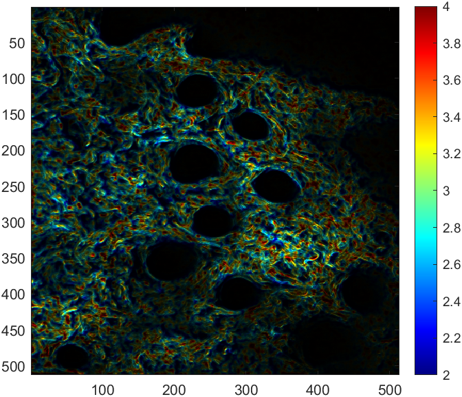

# modifiedBlanket2D

Calculates a 2D fractal dimension map

---

## Syntax

`fractalDimension = modifiedBlanket2D(img,kernelSize)`

---

## Description

[fractalDimension](#fractaldimension) = modifiedBlanket2D([img](#img),[kernelSize](#kernelsize)) returns the pixel-wise 2D fiber orientation map (orientImage) for an input image (image) based on differences in a local area, dictated by kernelSize. The input image can also be blurred during function execution via the filt_on input.

---

## Examples

## **Analysis of collagen SHG image**

Load the image

```matlab
shgim = imread('./documentation/modifiedBlanket2D/SHG Intensity Image.tif');
```

Calculate the pixel-wise intensity-based fractal dimension

```matlab
fractalDimension = modifiedBlanket2D(shgim,5);
figure; imagesc(fractalDimension,'AlphaData',single(shgim)./8191); colormap jet;
caxis([2 4]); % Adjust color limits (if necessary)
axis image; colorbar;
set(gca,'Color',[0 0 0]); % Set background color to black
```



---

## Input Arguments

## img

Image that will be used to compute pixel-wise fractal dimension.

*Data types: `single` | `double` | `uint8` | `uint16` | `uint32`*

## kernelSize

Size of local window that will be used to compute local fractal dimension. The input value is a radius for a disk, such that the actual window size is 2*kernelSize.
*Data types: `double`*

---

## Output Arguments

## fractalDimension

Pixel-wise map of fractal dimension based on local window size.

*Data types: `single`*

---

## [Return to top](#modifiedblanket2d)
